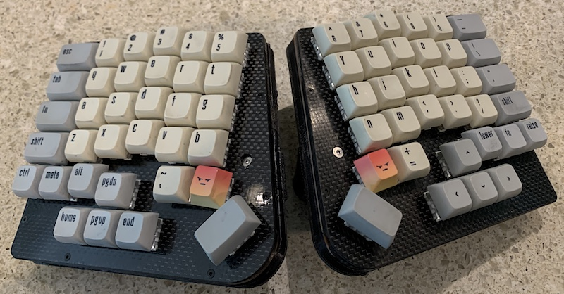

# FreiKey: Firmware for fully self-designed & manufactured keyboards

My fully custom ergonomic two piece Bluetooth keyboard. This is forked from the
[ErgoBlue](https://github.com/kevinfrei/ErgoBlue) repository, which is now
effectively dead, since I'm not using the ErgoDox/ErgoBlue layout any longer.

## Software

I have been refactoring this stuff a bit, and it's cleaner, but still not quite
where I want it to be. Once I'm happy with it, I'll probably write more about
how to use the software. For now, you'll just have to stare at it. You need to
install the arm-none-eabi version of GCC, as I hate the Arduino IDE and have
been using a tool I built (https://github.com/kevinfrei/Arduino2Make) to
just use `make` to build & flash the firmware.

## Quick Summary

I designed & manufactured these keyboards all myself. They're using a pair of
AdaFruit Feather nRF52's, same as the ErgoBlue keyboard I wired together
myself. The reason for the new designs are two-fold:

1. A better fit for my thumbs. The ErgoDox thumb cluster took a couple weeks to
   get accustomed to, and when I've gone back and tried it after having grown
   accustomed to my new FreiKey, I have the same problem: the cluster is too far
   away. My thumb doesn't naturally 'rest' where the cluster is.
2. A reasonable place for an "Arrow-T". Yes, I could have mapped an arrow
   cluster somewhere on the ErgoDox, but whereever it went, it would have been
   moving around a key that I didn't want to move/relearn. FreiKey has an arrow
   cluster (and, on the other side, a pgup/pgdn/home/end cluster) directly below
   the home row. You just have to slide your hand down about 2 inches!

The walnut keyboard (top) I've called 'FreiKeys'. It's got an aluminum keyplate
and a 2500mAh battery in each half. The lower one is called 'Karbon'. The
keyplate is milled out of 1.5mm carbon fiber. The middle layers are 3D-printed
PLA (space for a battery, etc...) and then the back 2mm carbon fiber. Karbon is
the second generation of my custom keyboard. The primary problems I had with
FreiKeys are that the placement of \`/~ and =/+ were pretty hard to hit
reliably, which is frustrating while coding, and I just don't really use the
bottom row (except for the curly brace/brackets) and when I did, they were
highly inconvenient to actually hit. So I removed the bottom row, and moved
around the thumb keys enough so that hopefully it will be easier to hit the
\`/~ and =/+ keys with my thumbs. I'm enjoying it thus far, though typing this
paragraph is the first time I've used this keyboard :D.

For these keyboards, rather than cutting an aluminum plate and manually wiring
the matrix, I designed a PCB, with a spot to put the Feather controllers. This
was the first time I've designed (and milled) a PCB, as well as the first time
I've milled aluminum, and carbon fiber, so it's been an adventure. A few key
points worth noting:

Stuff I've learned from FreiKeys:
* Small end mills break easily (particularly on Aluminum)!
* Large 'V' bits **don't** break easily (certainly not while ripping through
some copper clad PCB blanks)
* Clearing away the spare copper of a PCB isn't necessary. You just need to make
  sure each circuit that matters is isolated (much faster to mill.)
* Aluminum is much harder than wood
* Milling aluminum is messy (either using cutting fluid, thereby extending the
  life of your bits, or just those damn aluminum shavings, which aren't
  magnetically responsive and behave like glitter)
* New router bits cut aluminum much better
* I still haven't got the right speed/feed for milling the copper off of copper
  clad PCB's cleanly
* Sanding your finished PCB can get rid of the messy edges, but can also sand
  off pieces of the trace you care about!
* Surface mounting something that isn't really designed for it is awkward

Stuff I've learned from Karbon:
* Carbon is theoretically slower to mill than aluminum, but if you mill it in a
water bath, it's super easy to just start the program, and ignore it, as the
water keeps the bit from overheating.
* Sharp small V-bits hold up just as well as the big spiral V-bits, and leave a
clean edge!
* Fusion360 has Eagle circuit stuff built in now, but it's still restricted to
circuit boards smaller than half a keyboard, so I'm still just doing everything
manually...
## The Good Stuff
Here's stuff that doesn't live on GitHub (A bunch of AutoDesk Fusion 360 projects)
### FreiKeys stuff
* [The aluminum
keyplate](https://a360.co/2L1pxVX) is the same for both the left & right hand.
* [The left side PCB](https://a360.co/2KXEIiF).
* [The right side PCB](https://a360.co/2KZmqhe).
* [The wooden cases](https://a360.co/2L0rK3Y) in a single project.
### Karbon
 * Everything for this keyboard is in a single project,
[here](https://a360.co/2ZAojex)
