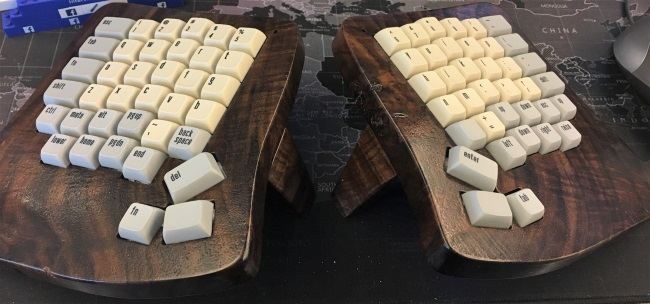
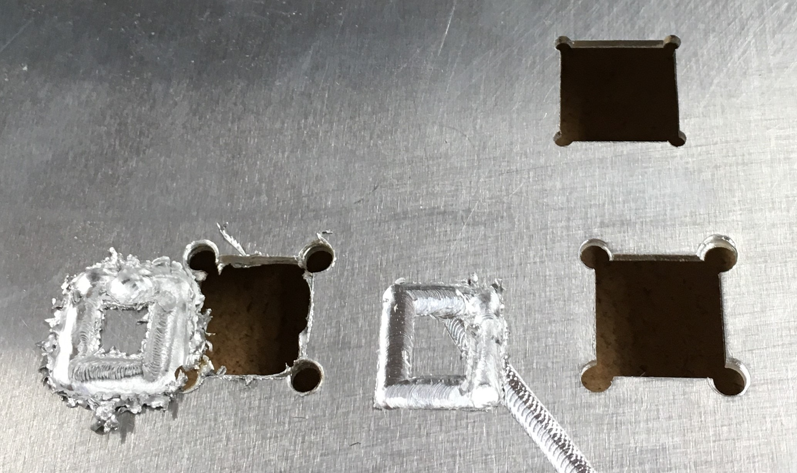

# FreiKey: My fully self-designed keyboard
My fully custom ergonomic two piece Bluetooth keyboard. This is forked from the
[ErgoBlue](https://github.com/kevinfrei/ErgoBlue) repository, which is now
effectively dead, since I'm not using the ErgoDox/ErgoBlue layout any longer.

## Quick Summary

I designed & manufactured this thing all myself. It's using a pair of AdaFruit
Feather nRF52's, same as the ErgoBlue keyboard I wired together myself. The
reason for this keyboard is twofold:

1. A better fit for my thumbs. The ErgoDox thumb cluster took a couple weeks to
   get accustomed to, and when I've gone back and tried it after having grown
   accustomed to my new FreiKey, I have the same problem: the cluster is too far
   away. My thumb doesn't naturally 'rest' where the cluster is.
2. A reasonable place for an "Arrow-T". Yes, I could have mapped an arrow
   cluster somewhere on the ErgoDox, but whereever it went, it would have been
   moving around a key that I didn't want to move/relearn. FreiKey has an arrow
   cluster (and, on the other side, a pgup/pgdn/home/end cluster) directly below
   the home row. You just have to slide your hand down about 2 inches!

Rather than cutting an aluminum plate and manually wiring the matrix, I designed
a PCB, with a spot to put the Feather controllers. This was the first time I've
designed (and milled) a PCB, as well as the first time I've milled aluminum, so
it's been an adventure. A few key points worth noting:
* Small end mills break easily (particularly on Aluminum)!
* Large 'V' bits **don't** break easily (certainly not while ripping through some copper clad PCB blanks)
* Clearing away the spare copper of a PCB isn't necessary. You just need to make
  sure each circuit that matters is isolated (much faster to mill.)
* Aluminum is much harder than wood
* Milling aluminum is messy (either using cutting fluid, thereby extending the
  life of your bits, or just those damn aluminum shavings, which aren't
  magnetically responsive and behave like glitter)
* New router bits cut aluminum much better
* I still haven't got the right speed/feed for milling the copper off of copper
  clad PCB's cleanly
* Sanding your finished PCB can get rid of the messy edges, but can also sand
  off pieces of the trace you care about!
* Surface mounting something that isn't really designed for it is awkward

## Narrative

With that, here's what I did:

First, I swiped the ErgoDox STL files to get a good 'starting point' for key
layout. I like the ortholinear, staggered fingers for the ErgoDox. I actually
shifted the index finger to be a little lower than the ring finger, and pulled
the G and H rows down a little bit more, because it made sense to me (at least
for my hand/finger shape). Next, I deleted the "inner" row of keys. They were
always too far a reach, and I didn't really find them that useful. I always had
to look to see what I was hitting. I then added an extra set of 3 keys in the
J/K/L columns to provide the Arrow-T locations. Finally, I put a few keys in a
rainbow shape near where I figured my thumb would be comfortable. Instead of
just milling it in aluminum (which I knew was going to be messy), I extruded the
key holes into 'fake' keys and milled the shape out of a chunk of old styrofoam
insulation I've been carrying around for years. It's super easy to mill, and
holds a shape nicely. This gave me an opportunity to sort of try the layout of
the thumb cluster to see if it was comfortable. Turns out, I needed the keys a
little closer. At the same time, I figured it wouldn't hurt to add another key
beside the arrow cluster.

Once I had the key layout, I milled a baseplate out of 1.6mm aluminum. This was
my first time milling aluminum, so I broke a lot of bits, but eventually got a
finished plate. I stuck a bunch of keyswitches in the plate to get a feel for
them, and decided I needed to change the thumbs a bit more. I turned the
'resting' key from a 1x1.5 to a simple 1x1 key, and pulled the 1.5 and 1.25 keys
even closer, leaving the solitary 1x1 at the bottom. In addition, I had started
designing the PCB & wooden cases and realized that I needed to carve out a space
for a battery, so I took out a chunk from the aluminum plate under the wrist
wrest to put it.

For the PCB's, I started out with a matrix, similar to what I did for the
ErgoBlue project. Once I had the matrix, I started running traces. I didn't
really optimize for anything, here. I'm sure I could have done a much better job
at preventing myself from needing to do so much soldering of wire on the
diode-side of the PCB if I'd spent more time. Maybe next project :)

The big, exciting addition to this project is an LED. While the ErgoBlue worked
fine, I found only being able to use the "typing stuff into a text window"
capability to communicate status a bit of a bummer. Each half has a solitary LED
in the upper 'inside' corner, near the '5' and '6' keys. As of this writing, the
only thing that it does is flicker when you're over 10% battery life (and you
hit a combination of 4 keys), or stay solid if you're under 10%. But I plan on
addition more capabilities "soon".

For the wood cases, there are a couple things of note. The first is that I had
the leg (almost) fully modeled, so I went ahead and had the CNC cut it out. It
was kind of slow, because of the tapers, but resulted in a completely consistent
leg length, which is somewhat difficult to do manually on such a small part. The
other interesting element of the case is that the leg is attached with a cheesy
little 1" x 1/2" hinge, which has a small cut-away on the "inner" edge of the
case, which allowed for a smaller case. I had milled one case with enough space
to attach the leg hinge on the underside of the case, but that resulted in a
rather chunky looking case. I prefer the new version.

A few final points of interest: I'm using 2500mAH batteries from AdaFruit. They
last about a week, even with basically *no* attention to power consumption. If
you use different batteries, you'll need to change the shape of the battery
cut-outs to match. I carved the cases out of walnut this go around. It's a
gorgeous, dark wood, and is hard enough that I didn't have *any* breaking
pieces, even with connections of less than a 50 square millimeters.

## The Good Stuff

Here's stuff that doesn't live on GitHub (A bunch of AutoDesk Fusion 360 projects)
* [The aluminum 
keyplate](https://a360.co/2L1pxVX) is the same for both the left & right hand.
* [The left side PCB](https://a360.co/2KXEIiF).
* [The right side PCB](https://a360.co/2KZmqhe).
* [The wooden cases](https://a360.co/2L0rK3Y) in a single project.

Here's a view pictures of the various parts in various stages of creation:

### Milling Aluminum is Kinda Messy

This was my practice sheet of aluminum. The first problem was bad "speeds and
feeds". The second was that a 1/8" bt is just too big. I didn't want the corners
that 'cleaned out'. The final key-hole was cut using a single-flute 2mm bit,
which can be had for cheap on Amazon.
